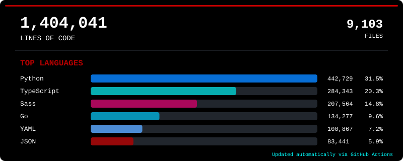

# Ingeniero en TI de Mazatlán | Infraestructura, Redes y Ciberseguridad | Homelab con Wazuh, Proxmox, Docker | También desarrollo en Python/SQL

  

---

  
  
  

---

## 👨‍💻 Perfil Profesional

Analista de seguridad enfocado en el desarrollo seguro (DevSecOps), automatización de infraestructura y análisis de código. Especializado en auditar entornos y empaquetar soluciones robustas que mitiguen vulnerabilidades antes del despliegue en producción.

* 🔭 **Enfoque Actual:** Hardening de pipelines CI/CD y análisis estático de código (SAST/DAST).
* ⚙️ **Automatización:** Creación de herramientas personalizadas en **Python** y **Go** para auditorías de seguridad.
* 🧠 **Intereses:** Seguridad en contenedores (Docker/K8s), gestión de configuraciones seguras (YAML/JSON) y Cloud Security.

---

## 🛠️ Skills & Arsenal Técnico

### 💻 Lenguajes & Scripting (Secure Coding)

  
  
  
  

### ⚙️ Infraestructura como Código (IaC) & Configuración

  
  
  
  

---

## 🧪 Proyectos y Laboratorios de Seguridad

### 🔍 [Analizador SAST Automatizado con Python](https://github.com/TU_USUARIO/tu-repositorio)
> Herramienta en Python para escanear repositorios locales en busca de credenciales expuestas, configuraciones erróneas en archivos **YAML/JSON** y dependencias vulnerables antes de realizar commits.

### 🛡️ [Hardening de Plantillas e Infraestructura Docker](https://github.com/TU_USUARIO/tu-repositorio)
> Repositorio de configuraciones seguras y políticas de mínimos privilegios para despliegues de aplicaciones web, reduciendo la superficie de ataque en entornos productivos.

---

## 📈 Actividad en GitHub

  

---

  

